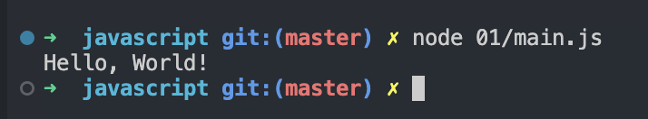
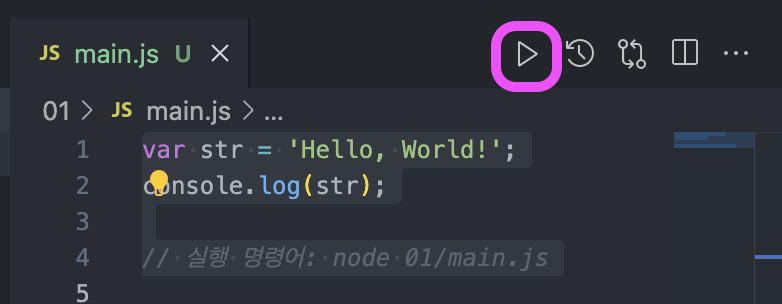
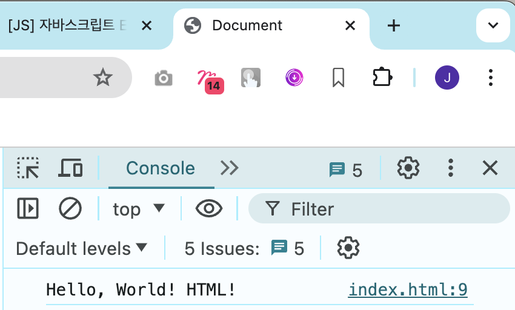
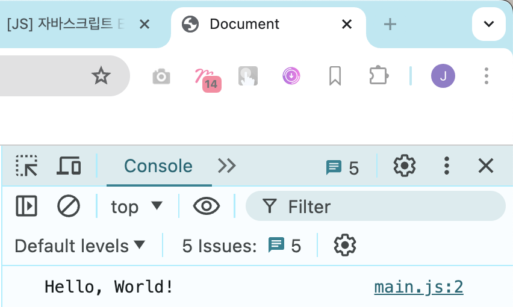
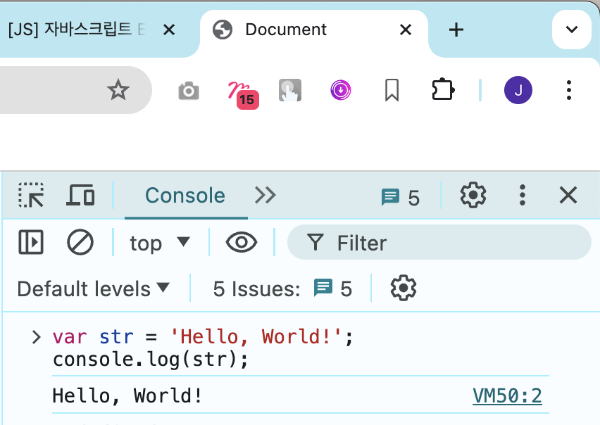

# 정리하기

## Node JS

### Node 버전은 왜 중요한가요?

프로젝트를 진행할 때 사용하는 라이브러리들이 다 Node JS의 버전에 종속되어있기 때문입니다.

즉, Node 버전이 낮으면 지원되지 않는 라이브러리들이 생기기 때문에 주기적으로 Node JS와 라이브러리들의 버전을 업데이트 해야 합니다.

---

### LTS 버전과 Current 버전

#### LTS 버전

대부분의 라이브러리가 지원하는 버전입니다.

#### Current 버전

가장 최신버전이지만 지원이 안될 수 있는 버전입니다.

---

### NPM은 무엇인가요?

Node JS의 패키지들을 관리해주는 도구입니다. 일반적으로 Node JS의 설치와 동시에 NPM이 설치됩니다.

`npm -v` 명령어를 통해 버전을 확인하실 수 있습니다.

---

## VSCode

### Prettier Extensions 추가 설정

settings.json 파일에 다음 설정을 추가합니다.

#### 저장과 동시에 포맷팅 적용

```json
// settings.json

"editor.codeActionsOnSave": {
  "source.fixAll": "explicit"
},
"editor.defaultFormatter": "esbenp.prettier-vscode",
"editor.formatOnSave": true
```

#### 탭간격 변경하기 (4 -> 2)

```json
// settings.json

"editor.tabSize": 2,
```

---

## JavaScript

### JavaScript 실행하는 방법

#### 터미널에서 `node` 명령어로 실행하기



#### VSCode의 실행 버튼으로 실행하기



#### HTML 파일을 사용해서 실행

HTML 파일을 생성 후, 다음과 같이 `<script>` 태그에 들어갈 내용을 다음과 같이 작성합니다.

```html
<!DOCTYPE html>
<html lang="en">
	<head>
		<meta charset="UTF-8" />
		<meta name="viewport" content="width=device-width, initial-scale=1.0" />
		<title>Document</title>
		<script>
			var str = 'Hello, World! HTML!';
			console.log(str);
		</script>
	</head>
	<body></body>
</html>
```

실행 후, 개발자 도구를 열어서 해당 내용이 잘 출력되었는지 확인합니다.



#### 외부의 JavaScript 파일을 불러와서 사용하기

HTML 파일을 생성 후, 다음과 같이 `<script>` 태그의 src 속성을 다음과 같이 작성합니다.

```html
<!DOCTYPE html>
<html lang="en">
	<head>
		<meta charset="UTF-8" />
		<meta name="viewport" content="width=device-width, initial-scale=1.0" />
		<title>Document</title>
		<script src="main.js"></script>
	</head>
	<body></body>
</html>
```



#### 개발자 도구에 직접 코드를 작성하기

개발자 도구를 열고, 아래의 코드를 그대로 입력합니다.

```javascript
var str = 'Hello, World! HTML!';
console.log(str);
```

개발자 도구의 출력 결과를 확인합니다.



### HTML 파일에서 JavaScript 파일을 불러오는 옵션

#### `<body>` 태그 하단에서 불러오기

`<body>`태그 안에 있는 내용이 렌더링 된 후, javascript 파일을 불러오고, 실행합니다.

**작업 1**

1. body 렌더링
2. javascript 파일 불러오기
3. javascript 파일 실행하기

#### `<body>` 태그 상단에서 `async` 옵션과 함께 불러오기

`<body>`태그 안에 있는 내용을 렌더링 함과 동시에, javascript 파일을 불러오고, 실행합니다.

**작업 1**

1. body 렌더링

**작업 2**

1. javascript 파일 불러오기
2. javascript 파일 실행하기

#### `<body>` 태그 상단에서 `defer` 옵션과 함께 불러오기

`<body>`태그 안에 있는 내용이 렌더링 함과 동시에, javascript 파일을 불러옵니다. `<body>`태그 안에 있는 내용의 렌더링이 완료되면, javascript 파일을 실행합니다.

**작업 1**

1. body 렌더링

**작업 2**

1. javascript 파일 불러오기
2. body 렌더링 완료를 기다렸다가, javascript 파일 실행하기

### 변수를 정의하기 위한 예약어 `var`, `let`, `const`의 차이점

#### 변수를 선언하는 방법

var 라는 예약어를 작성한 후, num이라는 변수의 이름을 정의합니다. 이어서 10 이라는 값을 넣어준 다음 ;(세미콜론)을 사용해서 코드의 종료를 알려줍니다.

```javascript
var num = 10;
```

그런데, 요즘에는 var 라는 키워드를 사용하지 않게 되었습니다. 그 이유는 무엇일까요?

var 라는 키워드에는 치명적인 단점이 있습니다. 같은 이름의 변수를 선언했을 경우, 이전 변수의 값을 덮어씀과 동시에 에러조차 발생하지 않는다는 겁니다.

```javascript
// 01.js
var a = 10;
```

```javascript
// 02.js
var a = 20;
console.log(a);
```

```html
<script src="01.js"></script>
<script src="02.js"></script>
```

이렇게 `var` 예약어를 사용하여 2개의 파일을 불러와서 실행하면, 아무 에러도 나지 않고 a 라는 변수의 값이 20으로 변경됩니다.

즉, 하나의 페이지에서 사용하고 있는 JavaScript 파일 중에서 어떤 파일이 나와 동일한 변수명을 사용하고 있는지 알 수 없다는 것입니다.

이러한 단점 때문에, ES6에서 `let` 이라는 예약어가 등장했고, 대부분의 브라우저가 이를 지원하게 되면서 `var` 대신 `let` 이라는 예약어를 사용하게 되었습니다.

`let`은 `var`와 동일하게 변수를 선언하지만, 동일한 이름의 변수를 선언할 시, 에러를 발생시킵니다.

`const`는 let과 동일하지만, 한번 값을 지정하면 변경할 수 없다는 특징을 가지고 있습니다.

### JavaScript 용어 정리

```javascript
const maxLevel = 99 + 1;
```

| 키워드   | 이름                                                              |
| -------- | ----------------------------------------------------------------- |
| const    | `예약어`                                                          |
| maxLevel | `식별자`(앞에 const, let과 함께 쓰이는 경우 `변수명` 이라고도 함) |
| =        | `연산자`(`할당연산자`)                                            |
| 99       | `값`                                                              |
| 99 + 1   | `표현식`(표현식은 무조건 값으로 도출이 된다!)                     |
| ;        | `세미콜론`(코드의 끝)                                             |

```javascript
function sum() {}
```

| 키워드   | 이름                                                             |
| -------- | ---------------------------------------------------------------- |
| function | `키워드`                                                         |
| sum      | `식별자` (앞에 function와 함께 쓰이는 경우 `함수명` 이라고도 함) |

- function: [키워드]
- sum: [식별자], or 앞에 function와 함께 쓰여진다면 [함수명] 이라고도 한다.

이처럼, `식별자`는 앞에 오는 키워드에 따라서 다른 이름으로 불기도 한다.

### VSCode에서 주석을 추가하는 방법

| 이름         | 단축키                   |
| ------------ | ------------------------ |
| 한 줄 주석   | [cmd] + [/]              |
| 여러 줄 주석 | [Shift] + [option] + [A] |
